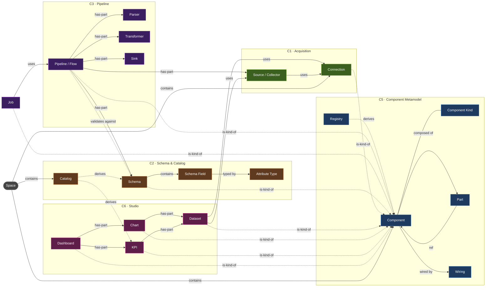
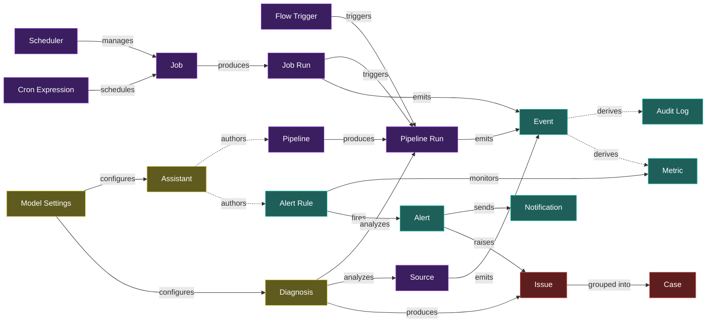

# Inspecto — Concept Relationship Graph (model-level)

> **Canonical terms live in [`GLOSSARY.md`](GLOSSARY.md).** This analysis predates the 2026-06-29 vocabulary
> lock, so a few node labels still use the old words — read *Issue→Incident*, *Flow→Pipeline*, *Data Store→
> Dataset*, *chart-instance→Widget*. The relationships are unchanged.
>
> A graphify-style **analysis** of how the business concepts in [`GLOSSARY.md`](GLOSSARY.md) relate to one
> another **at the model level**. This is a *conceptual / domain* graph — nodes are business concepts, edges are
> typed relationships with cardinality. It is **not** the code graph (`graphify-out/`) and it does **not**
> redefine any model. Grounded in the Component metamodel ([`superpower/component-model.md`](superpower/component-model.md) §3)
> and the operational concepts in the glossary.

---

## 1. Node inventory (grouped by community)

Each node is a domain concept. `kind` = whether it is a first-class **Component** (authored artifact), a
**runtime** record (produced by execution), a **derived** view, or a **leaf** value object.

| # | Community | Nodes |
|---|---|---|
| C0 | **Tenancy** | Space · Config |
| C1 | **Acquisition** | Connection · Source (Collector) · Acquisition Ledger |
| C2 | **Schema & Catalog** | Schema · Schema Field · Attribute Type · Catalog · Rule |
| C3 | **Pipeline Processing** | Pipeline (Flow) · Pipeline Step · Parser · Transformer · Enrichment · Sink · Flow Trigger · Pipeline Run |
| C4 | **Scheduling** | Job · Scheduler · Job Run · Cron Expression |
| C5 | **Component Metamodel** | **Component** · Component Kind · Part · Wiring · Registry |
| C6 | **Studio / Viz** | Dataset · Chart · KPI · Dashboard · KPI & Reports |
| C7 | **Observability** | Event · Audit Log · Metric · Alert Rule · Alert · Notification |
| C8 | **Incident & AI** | Diagnosis · Issue · Case · Assistant · Model Settings |

---

## 2. Edge taxonomy

Eight relationship types carry the whole graph. Direction is **subject → object**.

| Edge | Meaning | Plane |
|---|---|---|
| `contains` | ownership / lifecycle ( delete parent ⇒ delete child ) | structural |
| `is-kind-of` | the concept **is a** Component of this kind (metamodel spine) | structural |
| `has-part` | composite Component embeds this part (composition∪wiring) | structural |
| `uses` | references a **reused**, independently-owned Component | structural |
| `produces` | execution emits this runtime record | runtime |
| `triggers` | causes an execution to start | runtime |
| `emits` | writes this signal to the observability stream | runtime |
| `derives` | a read-only view computed from other nodes (no own store) | derived |

---

## 3. Structural graph — *what is made of what*

The metamodel spine (`is-kind-of`) plus composition (`has-part`) and reuse (`uses`).
Every authored artifact is a **Component**; composites embed parts; some parts are references to
independently-owned Components.

---

## 4. Runtime / operational graph — *what happens when it runs*

Execution records (`produces`), causation (`triggers`), and the observability stream (`emits` → `derives`).

---

## 5. Full edge inventory (with cardinality)

| Subject | Edge | Object | Card. | Note |
|---|---|---|---|---|
| Space | contains | every Component, Event, Config | 1—N | isolation boundary |
| Connection | — is-kind-of → | Component | — | atomic kind (leaf) |
| Source | uses | Connection | N—1 | many Sources per Connection |
| Source | tracked-by | Acquisition Ledger | 1—1 | watermark / dedup state |
| Source | emits | Event | 1—N | acquisition events |
| Schema | contains | Schema Field | 1—N | |
| Schema Field | typed-by | Attribute Type | N—1 | one of ~11 types |
| Catalog | derives | Schema, KPI | — | index / library view |
| Pipeline | has-part | Source, Parser, Schema, Transformer, Sink | 1—N | parts + DAG wiring |
| Pipeline | validates-against | Schema | N—1 | schema is also a part |
| Pipeline | produces | Pipeline Run | 1—N | execution history |
| Pipeline | — is-kind-of → | Component | — | composite kind |
| Flow Trigger | triggers | Pipeline Run | 1—N | scheduled/event/manual |
| Job | uses | Pipeline | N—1 | pipeline is a referenced part |
| Job | produces | Job Run | 1—N | |
| Scheduler | manages | Job | 1—N | the Operations panel |
| Cron Expression | schedules | Job | 1—1 | |
| Job Run | triggers | Pipeline Run | 1—N | a job run spawns pipeline run(s) |
| Component | composed-of | Part | 1—N | composite only |
| Part | ref | Component | N—1 | reuse + per-use override |
| Component | wired-by | Wiring | 1—1 | graph / layout / schedule / mapping |
| Component | classified-by | Component Kind | N—1 | the registry entry |
| Registry | derives | Component graph | — | composition ∪ reference, on-demand |
| Dataset | uses | Source, Connection, Dataset | N—N | only Studio kind reaching acquisition |
| Chart | has-part | Dataset | N—1 | channel-mapping wiring |
| KPI | has-part | Dataset | N—N | + threshold overlay |
| Dashboard | has-part | Chart, KPI | 1—N | grid-layout wiring |
| KPI & Reports | aggregates | KPI | 1—N | headline page |
| Pipeline Run | emits | Event | 1—N | |
| Job Run | emits | Event | 1—N | |
| Audit Log | derives | Event | — | filtered security view |
| Metric | derives | Event | — | aggregated signal |
| Alert Rule | monitors | Metric | N—1 | |
| Alert Rule | fires | Alert | 1—N | when threshold crossed |
| Alert | sends | Notification | 1—N | |
| Alert | raises | Issue | 1—1 | |
| Issue | grouped-into | Case | N—1 | |
| Diagnosis | analyzes | Pipeline Run, Source | N—1 | AI root-cause |
| Diagnosis | produces | Issue | 1—1 | |
| Config | configures | Space | 1—1 | `space.toon` |
| Model Settings | configures | Assistant, Diagnosis | 1—N | AI model + keys |
| Assistant | authors | Pipeline, Alert Rule, Config | — | AI drafting |

---

## 6. Analysis (graphify-style)

### God nodes — highest connectivity, where the model concentrates

1. **Component** — the structural singularity. *Every* authored artifact (Pipeline, Job, Schema, Dataset,
   Chart, KPI, Dashboard, Connection, Rule) is an `is-kind-of` Component, and Component additionally owns Part /
   Wiring / Kind / Registry. It is not a sibling of the other communities — it is an **orthogonal projection
   over all of them**. Highest degree by a wide margin.
2. **Pipeline** — the operational hub. It `has-part` five concepts (Source, Parser, Schema, Transformer, Sink),
   `validates-against` Schema, `produces` Pipeline Runs, is `used-by` Job, is `analyzed-by` Diagnosis, and is
   `authored-by` the Assistant. It bridges Acquisition → Schema → Scheduling → Observability → AI.
3. **Event** — the observability sink. Pipeline Runs, Job Runs, and Sources all `emit` Events; Audit Log and
   Metric both `derive` from them; Metric in turn feeds Alert Rules. **Operations is event-sourced** — Event is
   the single convergence point of the entire runtime plane.
4. **Dataset** — the Studio gateway. It is the only Studio kind whose parts (`uses` Source/Connection) reach
   *back* into Acquisition, and it is the part every Chart/KPI/Dashboard ultimately stands on.
5. **Space** — the containment root. Everything is owned by exactly one Space; high out-degree but it is a pure
   container.

### Communities — the model partitions into nine clusters (§1)

The clean layering is **Tenancy → Acquisition → Schema → Processing → Scheduling → Studio → Observability →
Incident/AI**, with the **Component Metamodel (C5)** cutting across all of them rather than sitting beside them.

### Surprising connections — the non-obvious bridges worth noticing

1. **Pipeline is simultaneously a composite *and* a part.** It is wired from parts (Source/Parser/Schema/…) yet
   is itself a referenced part of a Job. The model is genuinely recursive — `chart ∈ dashboard`, `dataset ∈
   chart`, `pipeline ∈ job` are the same shape at three scales.
2. **The FlowGraph (visual pipeline editor) *is* a Pipeline's `wiring` field.** The editor UI and a metamodel
   data field are the same object — not a view of it. Likewise a Dashboard's grid is its `wiring`, and a Chart's
   channel map is its `wiring`.
3. **Schema has dual citizenship** — a Catalog asset (C2) *and* a Pipeline part (C3). This raises the sharpest
   model question: is the pipeline's schema a **reference** to the catalog schema (shared, versioned) or an
   **inline copy** (forked)? (See §7.)
4. **Two graphs, one renderer.** The **Registry** (component-reuse projection) and the **Catalog lineage** graph
   (data-asset projection) are *different graphs over overlapping nodes*, both rendered by the same G6 host. They
   answer different questions — "what reuses what" vs "what flows into what."
5. **Dataset is the batch/live seam.** Because Dataset reaches into Source/Connection, the boundary between
   "ETL has already collected this" and "the chart queries it live" runs straight through Dataset.
6. **Diagnosis stitches the AI plane into Operations.** It `analyzes` Pipeline Runs/Sources (C3/C1) and
   `produces` Issues (C8) — the Assistant/model layer is wired directly into the operational failure path.
7. **Issue is the universal incident funnel.** Both `Alert → Issue` (threshold) and `Diagnosis → Issue` (AI)
   converge on Issue, which then rolls up into Case. Regardless of how a problem is detected, it lands in one place.
8. **Connection owns nothing.** It is a pure leaf referenced from two communities (a Source in Acquisition *and*
   a Dataset in Studio) — credentials with no downstream composition.

---

## 7. Suggested questions (what this graph is good at answering)

The most analytically valuable questions cross the most community boundaries:

1. **Schema linkage** — When a Pipeline embeds a Schema, is it a live reference to the Catalog Schema or a
   snapshot? This decides whether editing a Catalog Schema silently changes running Pipelines, and whether
   Schema versioning is needed. *(Crosses C2 ↔ C3.)*
2. **Run lineage** — A Job Run `triggers` a Pipeline Run, and both `emit` Events. What is the precise parent/
   child contract — does a Job Run own its Pipeline Run's events, or are they peers on the stream?
   *(Crosses C4 ↔ C3 ↔ C7.)*
3. **The batch/live boundary** — Does a Studio Chart reading a Dataset ever *trigger* acquisition, or only read
   already-collected data? Where exactly does pull-ETL stop and query-on-read begin? *(Crosses C6 ↔ C1.)*
4. **One graph or two?** — If Component is the universal kind, why do the Registry (reuse) and Catalog (lineage)
   stay separate graphs? What query would force them to merge? *(Crosses C5 ↔ C2.)*
5. **Issue provenance** — Since both Alerts and Diagnoses produce Issues, should an Issue always carry a
   discriminated "source" so Cases can be assembled across detection methods? *(Crosses C7 ↔ C8.)*
6. **Where does the Component metamodel stop?** — Connection, Rule, Schema are modelled as atomic Components. Is
   a *Source* a Component (it has config + uses Connection), or only a Pipeline part? The answer fixes the
   boundary of the metamodel. *(Crosses C5 ↔ C1.)*
