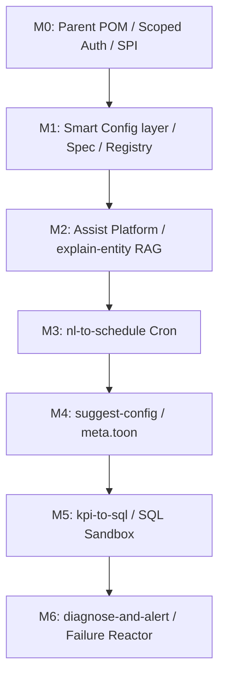

# UCC File Processor — Project Deep Dive & Architectural Review

This document provides a highly technical, deep-dive review and architectural assessment of the **UCC File Processor** codebase and its active transition from the `2.x` line to the `3.x` line. 

---

## 1. Executive Summary & Codebase Health

The UCC File Processor is a remarkably clean, high-performance, single-instance data platform. It is written in modern Java (Java 24) and leverages **DuckDB** as its embedded primary transformation engine. 

### Core Architectural Pillars (Delivered in 1.x / 2.x)
- **Stage-1 Ingest (`com.gamma.etl` / `com.gamma.inspector`):** An M..N multiplexer that parses, validates, and partitions raw files (CSV/CSV.GZ/binary) into Hive-partitioned Parquet or CSV structures. Designed to be embarrassingly parallel and crash-isolated by processing each batch using a dedicated, ephemeral DuckDB connection.
- **Stage-2 Enrichment (`com.gamma.enrich`):** Incremental and scheduled transformations (joins, rollups, foreign-key resolution) over the partitioned database views, also utilizing a dedicated DuckDB connection per job execution.
- **Control Plane (`com.gamma.service` / `com.gamma.control`):** An embedded JDK `HttpServer` REST API (~25 endpoints, Jackson JSON) providing monitoring, job execution (`JobService` / `JobConfig`), pipeline pausing/triggering, and reporting (`ReportService`).
- **Observability:** Prometheus metrics (`MetricsService`), status audit logging (`FileStatusStore` / `DbStatusStore`), and localized pipeline/run line-level execution logging.

### Current 3.x State (Milestone M0 / Foundation)
The codebase has successfully completed the prerequisite foundation for `3.x`:
1. **Module Separation:** Structured into a multi-module Maven reactor (`file-processor-parent` POM) with `file-processor` (the zero-new-dep core ETL engine & control plane) and `file-processor-agent` (an optional in-process agent container).
2. **Agent SPI:** Defined the `AssistAgent` SPI ([AssistAgent.java](file:///c:/sandbox/ucc-file-processor/file-processor/src/main/java/com/gamma/assist/spi/AssistAgent.java)) in core, with an auto-discovery and lifecycle mechanism in `SourceService` using `ServiceLoader`.
3. **Noop implementation:** Added [NoopAssistAgent.java](file:///c:/sandbox/ucc-file-processor/file-processor-agent/src/main/java/com/gamma/agent/NoopAssistAgent.java) to prove wiring and classpath isolation.
4. **Security Hardening:** Secured `ControlApi` ([ControlApi.java](file:///c:/sandbox/ucc-file-processor/file-processor/src/main/java/com/gamma/control/ControlApi.java)) with hierarchical scoped API tokens (`CONTROL`, `assist.write`, `assist.read`), constant-time token comparison, and a strict **fail-closed** mode (no open-by-default behavior if tokens are omitted).

---

## 2. Technical Gap Analysis (The Path to v3.x)

While the `2.x` line is solid, there are several structural limitations that must be addressed to enable high-quality **AI-assisted automation** and a **Web UI**. The core gaps are:

```
                                  GAPS IN THE PRESENT 2.x CORE:
                                  
   Config Imperative       Config IO & Side-Effects      Inefficient O(n) Searchs       Weak Security Perimeter
┌────────────────────────┐┌────────────────────────┐┌────────────────────────┐┌────────────────────────┐
│ No machine-readable    ││ Config loading is      ││ Finding config by name ││ Shared token only;     │
│ schema exists; rules   ││ welded to disk I/O,    ││ re-parses every file  ││ open-by-default;       │
│ are written in code;   ││ directory creation,    ││ on disk repeatedly;   ││ DuckDB connection has  │
│ LLM cannot validate.   ││ and private builders. ││ no memory registry.   ││ full file/network access│
└────────────────────────┘└────────────────────────┘└────────────────────────┘└────────────────────────┘
```

### Gap G1: Lack of Machine-Readable Config Schemas
- **Root Cause:** Custom configuration rules (types, required fields, constraints, enums, cross-field invariants) are coded imperatively inside `PipelineConfig.load()` or explained in prose.
- **AI/UI Block:** LLMs cannot reliably generate configs without a formal schema constraint; UI engines cannot generically render form fields or enforce client-side validation.

### Gap G2: Welded Config Parsing & File I/O
- **Root Cause:** `PipelineConfig` has private constructors and a file-only static factory `load(path)`. During load, it performs disk operations (e.g., `Files.createDirectories` for all dirs).
- **AI/UI Block:** Cannot parse/validate draft configurations in-memory from a REST body, database row, or network stream without first writing it as a temporary `.toon` file on disk.

### Gap G3: Inefficient, High-Overhead Registry Scans
- **Root Cause:** `SourceService.configFor(name)` and `pathFor(name)` iterate over a list of file paths and fully parse every `.toon` config file on disk during each query to find the match.
- **AI/UI Block:** Scale bottleneck. Listing and querying pipelines from a BFF/UI results in $O(N)$ high-frequency disk reads and parsing cycles.

### Gap G4: Unsandboxed SQL Operations
- **Root Cause:** DuckDB is used out-of-the-box. A SQL-generation agent could emit queries that read arbitrary local system files (`read_csv`), execute shell hooks, or write files to sensitive directories.
- **AI/UI Block:** Massive prompt injection and security vulnerability.

---

## 3. Review of the Proposed v3.x Roadmap

The proposed [v3-plan.md](file:///c:/sandbox/ucc-file-processor/docs/v3-plan.md) and [v3-architecture.md](file:///c:/sandbox/ucc-file-processor/docs/v3-architecture.md) present a highly strategic approach to resolving these gaps.



### Key Decisions Evaluated

1. **In-JVM SPI (`AssistAgent`):**
   - **Verdict:** Highly sound. Avoids HTTP latency between the core and the agent, enables direct JVM reference passing to services (`ReportService`, `EnrichmentService`, `JobService`), and keeps dependencies strictly isolated to `-agent` via classpath exclusion in the core shade.
2. **Keystone Milestone (M1: Smart Config):**
   - **Verdict:** Correctly identified as the cornerstone. By creating a declarative `ConfigSpec` model, the system gets a single source of truth that simultaneously drives in-memory parsing, structured API validation outputs, LLM grammar-constrained generation, and generic UI form rendering.
3. **Air-Gapped & Local-First Tiering:**
   - **Verdict:** Strict enforcement of air-gapping by omitting hosted SDK dependencies in the packaging ensures physical compliance rather than relying on configuration flags. Incorporating a hardware profile (dev-laptop, CPU-only, production) makes the local model approach highly practical.
4. **Validation-Safe but Confirm-First:**
   - **Verdict:** Pragmatic. Recognizing that a query passing `EXPLAIN` can still be semantically incorrect (e.g., incorrect join key) is a crucial insight. The "agent proposes, human/endpoints dispose" design ensures the human is always the ultimate authorization authority.

---

## 4. Deep-Dive Design Advice & Architectural Improvements

To ensure the implementation of the `3.x` branch is resilient, state-of-the-art, and bulletproof, several enhancements and design patterns are recommended below.

### A. Implementing the Smart Config Parse/Validate/Prepare Split (M1)

To solve **Gap G2** and **G3**, refactor config loading using a clean pipeline of pure classes. Below is the recommended class layout and pattern:

#### 1. The Pure Configuration Models & Specs
Avoid raw maps in the core engine. Group them using structured types.

```java
package com.gamma.config.spec;

import java.util.List;
import java.util.Optional;

public record ConfigSpec(String type, List<FieldSpec> fields, List<CrossFieldRule> rules) {}

public record FieldSpec(
    String path,             // e.g. "processing.threads"
    String label,
    String description,
    FieldType type,          // STRING, INT, BOOL, ENUM, FILEPATH, CRON, SQL
    boolean required,
    Optional<Object> defaultValue,
    List<String> enumValues,
    Optional<String> pattern, // regex
    String uiHint            // select, text, cron-editor
) {}

public record CrossFieldRule(
    String id,
    String description,
    List<String> affectedPaths,
    Severity severity,       // ERROR, WARNING
    java.util.function.Predicate<Map<String, Object>> rule
) {}
```

#### 2. The Composable Config Loader Architecture
Implement `ConfigLoader` as a pure, dependency-injected orchestration unit:

```java
package com.gamma.config.io;

import com.gamma.config.spec.ConfigSpec;
import java.util.List;
import java.util.Map;

public final class ConfigLoader {
    private final ResourceLoader resourceLoader; // filesystem, classpath, or string

    public ConfigLoader(ResourceLoader resourceLoader) {
        this.resourceLoader = resourceLoader;
    }

    // Step 1: Decode JToon/JSON to raw Map (No side-effects)
    public Map<String, Object> decode(String resourcePath) throws IOException {
        String content = resourceLoader.load(resourcePath);
        return JToon.decode(content); // Decode to Map
    }

    // Step 2: Validate against Spec (Pure calculation)
    public List<ValidationFinding> validate(ConfigSpec spec, Map<String, Object> rawMap) {
        List<ValidationFinding> findings = new ArrayList<>();
        // 1. Enforce individual FieldSpec types, required-ness, regex bounds
        // 2. Evaluate all CrossFieldRules
        return findings;
    }

    // Step 3: Instantiate typed Config record (Pure calculation)
    public PipelineConfig parse(Map<String, Object> rawMap) {
        // Instantiate using a public builder or Map-based record constructor
        return new PipelineConfig(rawMap); 
    }
}
```
> [!TIP]
> Introduce `ResourceLoader` as an interface. This makes testing the parser extremely simple: mock the files by injecting a `MapResourceLoader` containing string configurations, eliminating all temp-file I/O in tests.

#### 3. Introduce `ConfigRegistry` to Solve O(N) Scans
Implement `ConfigRegistry` as an in-memory, thread-safe cache owned by `SourceService`.

```java
package com.gamma.service;

import com.gamma.etl.PipelineConfig;
import java.util.concurrent.ConcurrentHashMap;

public final class ConfigRegistry {
    private final ConcurrentHashMap<String, PipelineEntry> cache = new ConcurrentHashMap<>();

    public record PipelineEntry(String id, String path, PipelineConfig config) {}

    public void register(String path, PipelineConfig config) {
        String id = config.identity().pipelineName();
        cache.put(id, new PipelineEntry(id, path, config));
    }

    public Optional<PipelineConfig> get(String id) {
        return Optional.ofNullable(cache.get(id)).map(PipelineEntry::config);
    }
    
    public Optional<String> getPath(String id) {
        return Optional.ofNullable(cache.get(id)).map(PipelineEntry::path);
    }
}
```
*At startup and upon configuration watch-key events, re-populate the `ConfigRegistry` once.* This turns `SourceService.configFor` into a lightning-fast $O(1)$ memory lookup, eliminating disk reads from API listing routes.

> **✅ Realized in v3.2.0 (M2 Smart Config), with these deltas from the sketch above:**
> - The validation result type shipped as **`Finding`** (not `ValidationFinding`); `CrossFieldRule.rule`
>   is a `Predicate<Map>` that returns **true when the invariant holds** (a `false` emits a `Finding`),
>   and is `@JsonIgnore`d so the rule catalog still serialises for UI/LLM.
> - The pure step is a **`fromMap`** factory on each config (`PipelineConfig`/`EnrichmentConfig`/`JobConfig`)
>   plus an instance **`prepare()`** for the single directory-creation side-effect; `load(path)`
>   delegates (`decode → fromMap → prepare`), so the parse stays pure and side-effect-free.
> - `ConfigRegistry` is keyed by **in-file identity** and **rebuilt once per poll cycle** (and at
>   construction); its rebuild callback fires the M1 catalog's `invalidate()`. The ingest run path
>   still uses raw registry paths + re-loads each cycle, so a cached config's frozen run-timestamp
>   never affects a run.
> - The schema-aware serializer shipped as **`ConfigCodec`** (canonical, comment-free, strict-decodable
>   encode + lenient decode); listing is via `GET /config/spec/{type}` + the existing `/pipelines`/
>   `/catalog` surfaces rather than a new `/configs` route.

---

### B. Bulletproofing the SQL Sandbox & Oracle (M5)

Milestone M5 proposes a locked-down DuckDB connection. Since the agent will be translating NLP into Stage-2 transformation queries, we must prevent **SQL injection** and **sandbox escapes** (e.g. prompt injection smuggling shell execution commands).

#### 1. Enforcing DuckDB Sandbox Constraints
When opening a connection to validate SQL generated by the agent, configure the following native DuckDB properties:

```java
package com.gamma.agent.sandbox;

import java.sql.Connection;
import java.sql.DriverManager;
import java.sql.Statement;
import java.util.Properties;

public final class SqlOracle {
    
    public static Connection openSandboxConnection(String tempDbPath) throws Exception {
        Properties props = new Properties();
        // Strict Sandbox Boundaries:
        props.setProperty("enable_external_access", "false"); // Disables file writes, network hooks, auto-installations
        props.setProperty("lock_configuration", "true");      // Prevents agent queries from calling SET or changing settings
        
        Connection conn = DriverManager.getConnection("jdbc:duckdb:" + tempDbPath, props);
        
        // Disable loaded file systems & auto-extension loading
        try (Statement stmt = conn.createStatement()) {
            stmt.execute("SET custom_extension_repository='disabled';");
            stmt.execute("SET autoload_known_extensions=false;");
            stmt.execute("SET autoinstall_known_extensions=false;");
        }
        return conn;
    }
}
```

#### 2. SQL Parser & Allow-list Validation
Relying solely on DuckDB's native sandboxing is insufficient. An LLM could attempt to construct nested subqueries containing system functions. 

> [!WARNING]
> DuckDB's `EXPLAIN` executes parts of the planning phase. If a query smuggles a function like `getenv('SECRET')` or `read_blob('/etc/passwd')`, it might evaluate during plan compilation. 

Before passing SQL to the database sandbox, implement a strict **lexical / structural AST validation step**:

1. **Disallow Multi-Statements:** Explicitly reject queries containing semicolons `;` (except inside quotes).
2. **Disallow System Functions:** Scan the query string (case-insensitive) and block dangerous system functions:
   - `read_csv`, `read_parquet`, `read_blob`, `read_json` (if external reads are prohibited)
   - `write_parquet`, `copy` (attempts to extract data)
   - `getenv` (environment variable extraction)
   - `pragma` (setting manipulation)
   - `install`, `load` (extension smuggling)
   - `query`, `eval` (meta-evaluation queries)
3. **Allow-list SELECT Only:** Enforce that the query begins with a common table expression (`WITH`) or a single `SELECT`. Block all DDL (`CREATE`, `DROP`, `ALTER`) and DML (`INSERT`, `UPDATE`, `DELETE`).

---

### C. Failure Diagnosis Reactor & Event Bus Enrichment (M6)

Milestone M6 hooks into the `BatchEventBus` to capture failed batches and async-diagnose them. To make this resilient and prevent the ingest engine from being degraded by slow AI diagnostics:

```
                  Ingest Thread (Fast, synchronous)
                         │
                 [ BatchProcessor ]
                         │
                 BatchEventBus.publish()
                         │
                         ▼
             [ Agent Failure Listener ]
                         │   (Non-blocking enqueue)
                         ▼
              [ LinkedBlockingQueue ]
                         │
                         ▼  (Virtual-Thread Worker Pool)
               [ AssistAgentExecutor ]
                         │   (RAG + LLM Triage + SQL Explain)
                         ▼
           Update Status / Persist Alert
```

1. **Async Separation:** The `BatchEventBus` currently executes subscribers synchronously on the pipeline runner's thread. The `AssistAgent` subscriber must immediately transfer the event into an internal `LinkedBlockingQueue` and return control to the core engine.
2. **Virtual-Thread-Backed Triage Executor:** Use a dedicated, single-threaded or low-concurrency executor backed by virtual threads (`Executors.newThreadPerTaskExecutor`) to process the queue. This prevents RAG operations and LLM lookups from competing for threads with ETL batch workers.
3. **Enriched `BatchEvent` Payload:**
   Ensure the `BatchEvent` payload carries complete diagnostic context:
   ```java
   public record BatchEvent(
       String batchId,
       String pipelineName,
       String status, // SUCCESS, FAILED
       List<String> errorSummary,
       Throwable exception,
       String offendingFile,
       Path quarantinePath,
       long processedRows
   ) {}
   ```

---

## 5. Summary of Recommended Actions for the 3.x Team

To accelerate the delivery of the `3.0.0-SNAPSHOT` branch and maximize its architectural quality, the development team should prioritize the following actions:

| Action Item | Scope / Milestone | Target Component | Benefit |
|---|---|---|---|
| **1. Registry Migration** | M1 | `SourceService` | Eliminates O(N) configuration parsing disk lookups, laying the groundwork for high-throughput REST API polling. |
| **2. ResourceLoader SPI** | M1 | `com.gamma.config.io` | Fully decouples config parsing from disk I/O, allowing instant configuration draft validation directly from REST bodies. |
| **3. DuckDB Oracle Hardening** | M5 | `com.gamma.agent.sandbox` | Implements secure, isolated, and read-only query planning to protect the database against malicious code execution. |
| **4. Queue-Backed Event Reactor** | M6 | `com.gamma.service` | Safeguards high-throughput ingest pipelines from being throttled by asynchronous, high-latency LLM error analysis tasks. |

---
*Deep-dive analysis prepared by Antigravity.*
