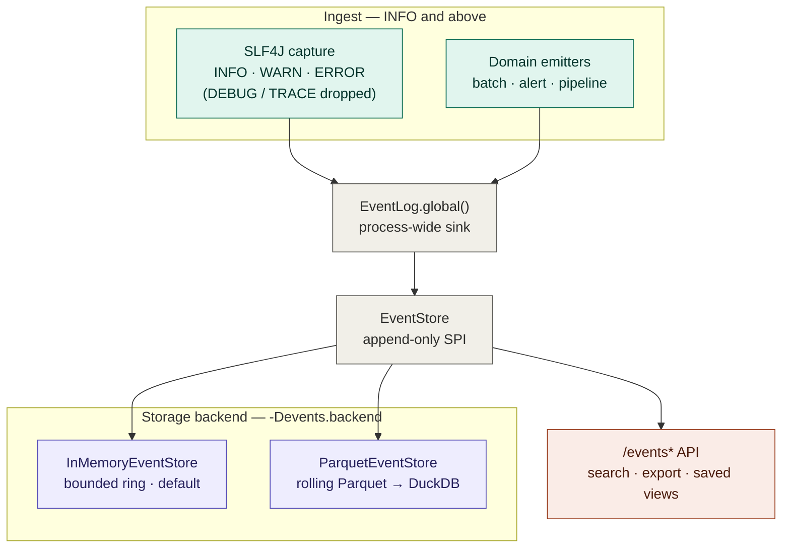

# Spec: Operational Intelligence Platform — Five-Phase Implementation Roadmap

> **Date:** 2026-06-13
> **Status:** Design / ready-for-planning (implementation roadmap)
> **Branch:** `4.x`
> **Source requirement:** [ticketing_systems_requirement.md](../../ticketing_systems_requirement.md)
> **Builds on (confirmed seams):** `com.gamma.etl.BatchEvent` / `com.gamma.service.BatchEventBus`
> (in-process pub/sub), `com.gamma.alert.*` (Alert/AlertRule/AlertService — Phase-2 seed already
> present), `com.gamma.service.StatusStore` + `DbStatusStore` (JDBC-over-DuckDB projection pattern),
> `com.gamma.etl.PartitionWriter` (DuckDB `COPY … TO … (FORMAT PARQUET, PARTITION_BY …)`),
> `com.gamma.sql.SqlViews` (`read_parquet(… hive_partitioning=true)`), `com.gamma.control.ControlApi`
> (JDK `HttpServer`, scoped routes), `com.gamma.metrics.MetricRegistry`.
>
> This document is a **self-contained implementation roadmap**. Each phase maps the requirement's
> intent onto concrete Inspecto packages/classes/endpoints, marks what already exists, and is grounded
> in real seams — confirm the cited classes before coding.

---

## 0. Architectural decision — storage substrate (answers "can rolling Parquet be the database?")

**Short answer: yes for the EVENT layer, no for the operational-object layer.** The requirement itself
splits the world into exactly these two layers, and they have opposite storage needs:

| Requirement layer | Nature | Right substrate | Why |
| :---------------- | :----- | :-------------- | :-- |
| **Layer 1 — `EVENT`** (immutable facts) | append-only, never modified, high-volume, structured | **Rolling Parquet, queried by DuckDB** | Columnar + compressed + write-once is Parquet's sweet spot. **The repo already does this**: `SqlViews.parquetScan` / `ParquetSummarizer` / `EnrichmentEngine` read `read_parquet('<root>/**/*.parquet', hive_partitioning=true)`, and `PartitionWriter` already writes Hive-partitioned Parquet via DuckDB `COPY`. No new technology. |
| **Layer 2 — Operational objects** (`ALERT`/`ISSUE`/`CASE`/`TASK`) | **mutable** (status `OPEN→ACK→RESOLVED…`), low-volume, relational | **DuckDB / PostgreSQL table** (the existing `DbStatusStore` JDBC pattern) | These rows *change*. Parquet cannot do that. |

### Why rolling Parquet works *as a database* for events

- The requirement defines `EVENT` as **append-only / never modified / high-volume** — which is precisely
  what a columnar immutable file format is built for.
- DuckDB turns "a directory of Parquet files" into "a table": one `read_parquet(glob, hive_partitioning=true)`
  view gives you full SQL search, filtering, aggregation, time-range scans, and `COPY … TO` export — all
  the Phase-1 "Event Viewer" verbs — with zero extra dependencies (DuckDB is already bundled).
- "Rolling" = a new file per time window (hour/day) under Hive partitions
  (`type=…/year=…/month=…/day=…`). Old windows age out by deleting whole files/dirs (retention is a
  `rm`, not a `DELETE`).

### Where rolling Parquet is *not* a database (the honest caveats)

1. **No in-place UPDATE/DELETE.** Immutable. Fine for events (never modified); **disqualifying for the
   mutable operational objects** of Phase 2+. Those go in a table store.
2. **No low-latency single-row writes.** Writing one file per event = the "small-files problem." You
   **buffer in memory and flush in batches** (size- or time-triggered). Sub-second durability of the
   newest events comes from the in-memory buffer, not the disk.
3. **No transactions / multi-writer coordination / secondary indexes / constraints.** It is an
   *analytical* store, not OLTP. Partition pruning (by `level`/date) is the only "index."
4. **Live tail** = the in-memory buffer (not-yet-flushed) **unioned with** the on-disk Parquet.

### Net design (matches the requirement's own layering)

```
Layer 1  EVENT (immutable facts)        → rolling Parquet  + DuckDB read_parquet   ← Phase 1
Layer 2  Operational objects (mutable)  → DuckDB/Postgres table (DbStatusStore-style) ← Phase 2+
Layer 3  Platform services (search/filter/saved-views/export/correlation/audit) → reused across both
```

---

## 1. The reuse thesis (why this is ~70–90% shared, per the requirement)

The requirement insists: build the **platform**, not five apps. Inspecto already has the spine:

| Requirement "engine" | Already in Inspecto | Phase that hardens it |
| :------------------- | :------------------ | :-------------------- |
| **Event Engine** | `BatchEvent` + `BatchEventBus` (commit/fail events); emission points across ingest/enrich/job | **Phase 1** generalizes this into a typed `Event` + durable `EventStore` |
| **Object Engine** | — (Alerts are in-memory only today) | **Phase 2** introduces one `OPERATIONAL_OBJECT` table for ALERT/ISSUE/CASE/TASK |
| **Search / Filter / Export** | DuckDB SQL + `SqlViews` + `COPY … TO`; `ControlApi` query routes | Phase 1 (events), Phase 2+ (objects) |
| **Workflow Engine** | `AlertService` lifecycle (implicit); `JobType` state | Phase 2 (config-driven state machine) |
| **Notification Engine** | `MetricRegistry`, `log.warn("[ALERT] …")`; agent's `diagnose-and-alert` | Phase 2 |
| **Rule / Correlation Engine** | `AlertService` rule eval; `MetadataGraphService` (catalog graph) | Phase 2 (rules), Phase 4 (`OBJECT_LINK` graph) |
| **Security Engine** | `ControlApi` scoped bearer tokens (PUBLIC/CONTROL/ASSIST_*) | all phases |
| **Intelligence** | `inspecto-agent` (assist skills, `SqlOracle`, catalog) | **Phase 5** |
| **UI Framework** | `inspecto-ui` (Angular, ag-Grid, multi-pane) | all phases (Event-Viewer-style explorer) |

So each phase is mostly **promotion + persistence + lifecycle** on top of seams that already exist.

---

## 2. Five-Phase Roadmap (mapped to the codebase)

### Phase 1 — Operational Event Viewer  *(this spec implements it; §3)*
**Outcome:** "What happened?" — durable, searchable, structured events.
- **New package `com.gamma.event`**: `Event` (immutable record), `EventLevel`, `EventType`,
  `EventStore` (SPI), `InMemoryEventStore` + `ParquetEventStore` (rolling), `EventQuery`, `EventLog`
  (process-wide facade, mirrors `MetricRegistry.global()`).
- **Ingestion (two paths):** (a) **domain emitters** at lifecycle points (job/batch/file/pipeline/alert);
  (b) **SLF4J capture** of `INFO`/`WARN`/`ERROR` (DEBUG/TRACE excluded — the "everything except debug" rule).
- **Storage:** rolling Hive-partitioned Parquet via the existing `PartitionWriter`; queried via
  `SqlViews.parquetScan(... hive_partitioning=true)`.
- **Surface:** new `ControlApi` routes `/events`, `/events/{id}`, `/events/search`, `/events/stream`
  (live tail), `/events/export`, `/events/views` (saved views). Reuse scoped-token auth + Jackson.
- **Correlation IDs:** `correlationId` = batchId / job-run-id, threaded through emitters.
- **Metrics:** `inspecto_events_total{level,type}` counter on the existing `MetricRegistry`.

### Phase 2 — Alert Center
**Outcome:** "Should I care?" — promote alerts from a transient ring to managed objects.
- **`com.gamma.ops.OperationalObject`** + **`ObjectStore`** (DuckDB/Postgres table, `DbStatusStore`
  JDBC pattern): one table keyed by `object_type` (`ALERT` first). Columns per requirement:
  `id, object_type, title, description, status, severity, priority, owner, assignee, created_at,
  updated_at, closed_at`.
- **Workflow Engine** (`com.gamma.ops.workflow`): config-driven state machine; Alert =
  `OPEN→ACKNOWLEDGED→RESOLVED`. Transitions append `OBJECT_ACTIVITY` events (reuse Phase-1 events).
- **Promote existing `AlertService`** to *persist* a fired `Alert` as an `OPERATIONAL_OBJECT(ALERT)`
  and **link** it to the triggering event (`OBJECT_LINK` Alert→Event, `CAUSED_BY`).
- **Notifications:** `NotificationService` SPI (log/webhook/email later); ack/escalation endpoints.
- **Adds routes:** `/alerts/{id}/ack`, `/alerts/{id}/resolve`, `/objects?type=ALERT&status=…`.

### Phase 3 — Issue Tracker
**Outcome:** "Manage the problem." — same `OPERATIONAL_OBJECT` table, `object_type=ISSUE`.
- Lifecycle `OPEN→ASSIGNED→IN_PROGRESS→RESOLVED→CLOSED`; ownership/assignee/priority already columns.
- **SLA tracking:** due-at + breach events (Phase-1 events) + a scheduled sweep on the existing
  `Scheduler`. Impact assessment = links to affected pipelines (catalog).
- Reuses the Object Engine, Workflow Engine, search/filter, comments/activity — **no new storage**.

### Phase 4 — Case Management
**Outcome:** "Investigate." — `object_type=CASE`, lifecycle `OPEN→INVESTIGATING→ESCALATED→RESOLVED→CLOSED`.
- **`OBJECT_LINK`** correlation graph (`from,from_type,to,to_type,relationship`) becomes first-class:
  `Case CONTAINS Issue`, `Issue ESCALATED_FROM Alert`, `Alert CAUSED_BY Event`. Render via the existing
  `MetadataGraphService` traversal machinery (it already does typed nodes/edges + depth/direction).
- **Evidence/Notes/Attachments:** `OBJECT_ATTACHMENT` + `OBJECT_COMMENT` tables; RCA templates as
  authored `.toon` (reuse `ConfigCodec`/`/config/write`).

### Phase 5 — Operational Intelligence
**Outcome:** "Learn." — route through the existing **`inspecto-agent`** (optional, classpath-gated).
- AI RCA / similar-incident / event clustering / NL-query / recommendations as **assist skills**
  (mirror `diagnose-and-alert`, `kpi-to-sql`, `report-sql`): the agent reasons, a human saves/acts; the
  lean core stays deterministic. Predictive alerting = new `AlertRule` metric types over the event store.

---

## 3. Phase 1 — implementation detail (build this now)

### 3.0 Architecture at a glance (as built)

Two ingest paths converge on one process-wide sink (`EventLog.global()`), which writes to a single
append-only `EventStore`; the backend is a deployment choice (`-Devents.backend=memory|parquet`), and
the `/events*` API reads back through the same store.



Capture is a logback `EventStoreAppender` (ThresholdFilter at INFO — the "everything except debug"
rule); `ParquetEventStore` buffers then flushes batches to Hive-partitioned Parquet
(`level/year/month/day`), queried via DuckDB `read_parquet` — the immutable-event layer of §0. The
live tail merges the not-yet-flushed in-memory buffer with the on-disk Parquet.

### 3.1 New package `com.gamma.event`

```
Event           record: eventId, ts(epochMillis), level(EventLevel), type(String),
                        source, pipeline?, correlationId?, message, attributes(Map<String,String>)
                        + toMap() (JSON-ready, LinkedHashMap, stable order)
EventLevel      enum  : TRACE, DEBUG, INFO, WARN, ERROR  (capture threshold = INFO)
EventType       const : LOG, SERVICE_STARTED, PIPELINE_REGISTERED, PIPELINE_PAUSED/RESUMED,
                        JOB_STARTED/SUCCEEDED/FAILED, BATCH_COMMITTED/BATCH_FAILED,
                        FILE_RECEIVED/FILE_QUARANTINED, ENRICHMENT_RUN, ALERT_FIRED, CONFIG_VALIDATED …
EventQuery      record: fromMs?, toMs?, minLevel?, type?, pipeline?, correlationId?, textContains?,
                        limit, offset
EventStore      iface : void append(Event);  List<Event> query(EventQuery);  List<Event> recent(int);
                        (append-only; no update/delete)
InMemoryEventStore    : bounded ring (CopyOnWrite/ArrayDeque), capacity-bounded; default lean store,
                        also serves the live-tail buffer + tests
ParquetEventStore     : buffers events; flush on size (e.g. 1000) or time-roll; writes via
                        PartitionWriter.write(conn,"evt_buf",root,"PARQUET","zstd","events_"+flushId,
                        List.of("level","year","month","day"), List.of());
                        query() builds SqlViews.parquetScan(root, hive=true) + WHERE; recent() from buffer
EventLog        final : process-wide facade — EventLog.global(); emit(Event)/emit(level,type,…);
                        installStore(EventStore). Mirrors MetricRegistry.global() so any layer emits
                        without constructor threading; also bumps the events_total metric.
```

**ParquetEventStore flush mechanics (reuse, don't reinvent):** maintain one DuckDB connection
(`DuckDbUtil`); on flush, insert the buffered rows into a scratch `evt_buf` table (cols incl. derived
`year/month/day` + `attributes` as JSON string), call the existing **`PartitionWriter.write(...)` full
overload** with `excludeColumns = List.of()` and a unique `baseName = "events_" + flushId` (so each flush
yields distinct files per partition — no overwrite), then `DELETE FROM evt_buf`. Query path = a DuckDB
view over `read_parquet('<root>/**/*.parquet', hive_partitioning=true)` (via `SqlViews`) with `WHERE`
from `EventQuery`; live tail merges the in-memory buffer.

### 3.2 "Everything except DEBUG" — the SLF4J capture decision

The repo binds **`slf4j-simple`**, which has **no appender SPI** — so auto-capturing existing
`log.info/warn/error` calls requires one of:

- **(A) Domain emitters only** *(lean, no dependency change):* emit rich structured `Event`s at the ~12
  lifecycle points listed in `EventType`. DEBUG internal logging stays console-only. Satisfies the
  requirement's "structured events instead of log parsing" intent, but does **not** auto-capture
  arbitrary `log.warn(...)` lines elsewhere.
- **(B) Domain emitters + SLF4J auto-capture** *(swap `slf4j-simple` → `logback-classic`, add a custom
  `EventStoreAppender` with a `ThresholdFilter` at `INFO`):* literally "everything except debug" — every
  existing `log.info/warn/error` becomes an `Event`, **plus** the rich domain emitters. Console output is
  preserved by a parallel `ConsoleAppender`. One standard dependency; touches the "keep core lean" guardrail.

**Recommendation: (B)** — it is the literal reading of the requirement and the only option that captures
the long tail of existing log sites without rewriting call sites. (A) is the fallback if a dependency
swap is unwanted. *Either way the domain emitters are built.*

### 3.3 Wiring (where Phase 1 plugs into the running service)

- **`SourceService`** constructs `EventLog.global()` store at startup (parallel to `MetricRegistry`),
  emits `SERVICE_STARTED`, and **bridges the existing bus**: `bus.subscribe(ev -> EventLog.emit(
  BATCH_COMMITTED/BATCH_FAILED from BatchEvent))` — so every committed/failed batch is already an event
  on day one (zero new emission points needed for the headline signal).
- **Emitters** added at: pipeline register/pause/resume (`SourceService`), job start/finish
  (`JobService`), file received/quarantined (ingest/`QuarantineManager`), alert fired (`AlertService`,
  ties Phase 1↔2). Each sets `correlationId = batchId|runId`.
- **`ControlApi`**: register `/events*` routes (CONTROL scope; `/events/stream` may be PUBLIC-read like
  `/metrics` if desired). `EventStore` reached via `service.events()`.
- **Backend selection** mirrors `status.backend`: `-Devents.backend=parquet|memory` (default `memory`
  for the lean fat-JAR; `parquet` for durable deployments), `-Devents.dir=inspecto-events`.

### 3.4 Acceptance (Phase 1)

- `Event`/`EventQuery`/`EventStore` + both stores, `EventLog`, capture bridge — unit tested
  (in-memory + a Parquet round-trip: append → flush → `read_parquet` query → filter by level/type/time).
- Every terminal batch produces a queryable `BATCH_COMMITTED|BATCH_FAILED` event end-to-end.
- `GET /events`, `/events/{id}`, `/events/search?level=&type=&pipeline=&from=&to=&q=`,
  `/events/export?format=csv|json`, `/events/views` (CRUD saved views) return as specified; auth scoped.
- `inspecto_events_total{level,type}` visible on `/metrics`.
- Full reactor stays green; no behavior change when `events.backend=memory` and capture-mode (A).

---

## 4. Development guidelines (from the requirement, applied here)

- **Platform services first** — `EventStore`/`ObjectStore`/`Workflow` are SPIs, not per-product code.
- **Separate immutable facts from operational workflows** — Parquet events vs. table objects (§0).
- **Configuration over custom code** — rules, workflows, RCA templates are `.toon` (reuse `ConfigCodec`).
- **Correlation is first-class** — `correlationId` from Phase 1; `OBJECT_LINK` graph from Phase 4.
- **Phased adoption** — each phase ships independently; later phases never force a redesign of earlier.
- **Lean core** — intelligence (Phase 5) stays in the optional `inspecto-agent`; core is deterministic.
